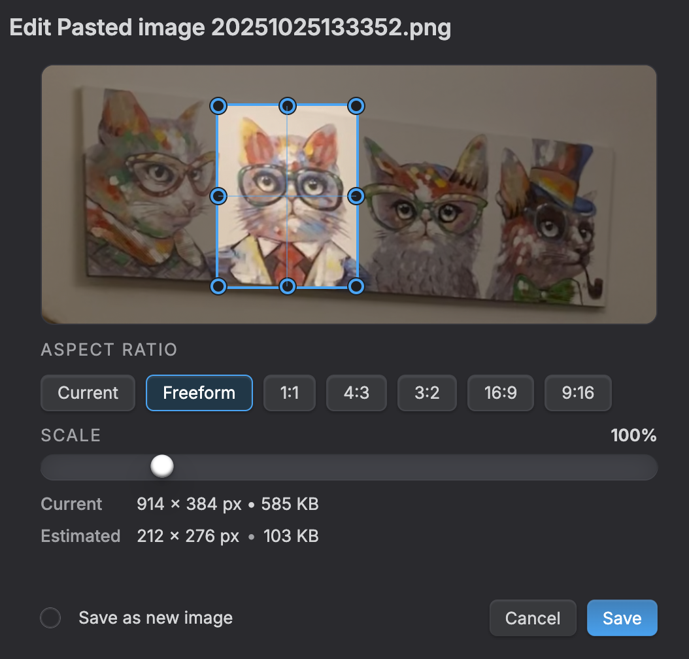
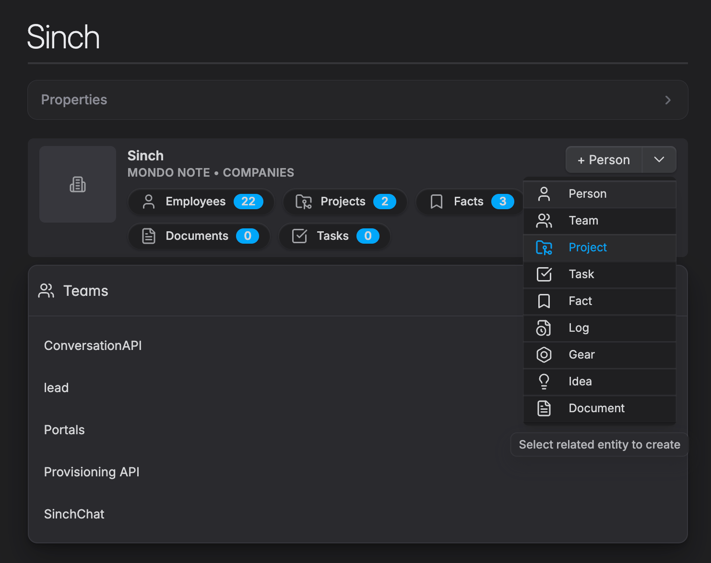
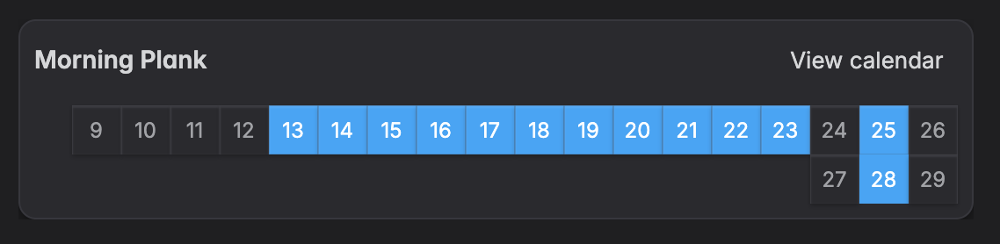
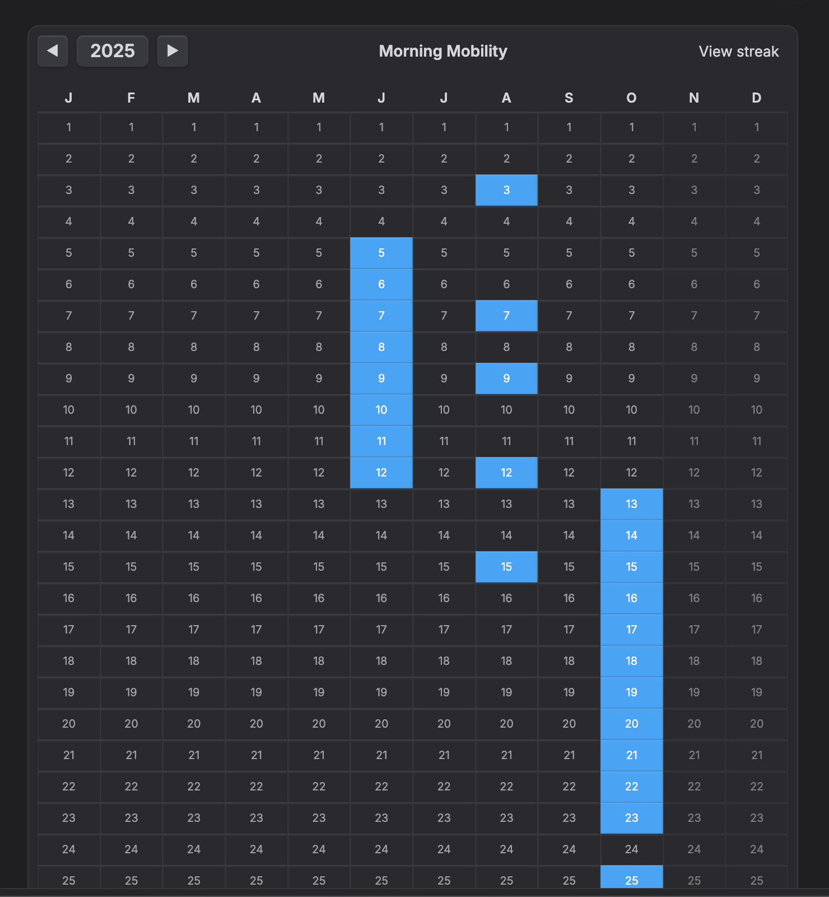
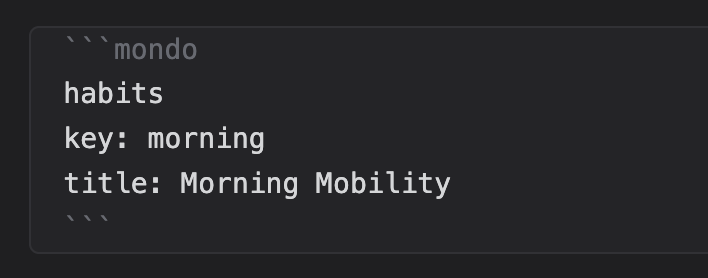
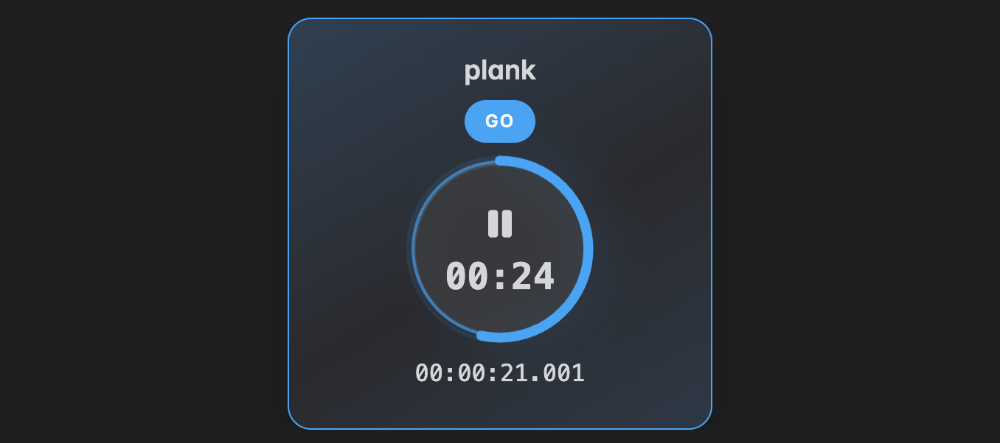

# Mondo

_Mondo_ is a general purpose plugin that adds plentiful of utilities to a standard [Obsidian](https://obsidian.md/) vault:

- [**🏚️ Dashboard:** vault overview and quick activities](#🏚️-dashboard)
- [**🎤 Dictation:** talk to your note to write its content](#🎤-dictation)
- [**📝 Transcription:** generate a transcription file out of any Obsidian recording](#📝-transcription)
- [**🔈 Voiceover:** transform your note into an audio file](#🔈-voiceover)
- [**🕰️ Timestamps:** quickly add timestamps into your notes](#🕰️-timestamps)
- [**🧘 Focus Mode:** hide most of the UI and focus on your writing](#🧘-focus-mode)
- [**🤖 Open in ChatGPT:** use your notes as templates for ChatGPT prompts](#🤖-open-in-chatgpt)
- [**🌆 Image Editor:** resize and crop images in your vault](#🌆-image-editor)
- [**📋 Paste Images:** paste images from clipboard directly into property fields](#📋-paste-images-into-properties)
- [**👫 Mondo IMS:** typed entities with strong relations](#👫-mondo-ims)
- [**📈 Habits Tracker:** embed a streak tracking app in any note](#📈-habits-tracker)
- [**⏱️ Training Timers:** embed a training trimer app in any note](#⏱️-training-timers)
- [**📆 Daily Notes:** quick and timestamped annotations](#📆-daily-notes)
- [**🖌️ Journaling:** distraction-free journaling experience](#🖌️-journaling)

> I'm developing this plugin to facilitate my life 🤘

🔥 Mondo's AI-related features (Dictation, Voiceover, LLM) support both OpenAI and Gemini. Just paste your API Key and the plugin will auto-detect the correct provider. 🔥


# How to Install & Update

ObsidianMondo is under active development so you would install it as a _Beta Tester_ at your own risk. But it's fine, I use it for myself first and it works, even if it needs a lot of love still!

1. First, install the [BRAT](https://obsidian.md/plugins?id=obsidian42-brat) that lets you install orther plugins directly from GitHub.

2. Open the _BRAT_ plugin preferences and click on "Add beta plugin"

3. Paste the following url:

```bash
https://github.com/marcopeg/mondo
```

> I suggest you keep it updated to the latest version, but at this point feel free to install whatever available release.

# Features

## 🏚️ Dashboard

Run the command `Open Mondo Dashboard` to open your vault's control center:

- **Quick Tasks** let you create new task-notes on the fly by typing or dictating your thoughs.
- **Relevant Notes** let you find your notes by frequency of utilization or history. And you can filter by _Entity Type (see the IMS feature)_-
- **IMS Entities Wall** wall let you jump to the various entities lists. Think \_"Obsidian bases on steroid".
- **Stats** show some numbers about your valut and offer some file based views of your stuff. Not only notes, but also images, audio and generic attachments across the whole vault.

## 🎤 Dictation

> This feature requires an [OpenAI API Key](https://help.openai.com/en/articles/4936850-where-do-i-find-my-openai-api-key)

Dictation lets you write your note's content with your voice, by sending a recording to OpenAI Whisper for transcription.

Use the command `Start dictation`, or press the microphone button to initiate a dictation session. The resulting transcription is inserted at your cursor's position.

## 📝 Transcription

> This feature requires an [OpenAI API Key](https://help.openai.com/en/articles/4936850-where-do-i-find-my-openai-api-key)

Use the command `Start transcription` when over an _audio note_ to start the transcription process.

Once done, a new note with the full transcription and a reference to the original audio will be created and opened for you.

## 🔈 Voiceover

> This feature requires an [OpenAI API Key](https://help.openai.com/en/articles/4936850-where-do-i-find-my-openai-api-key)

Use the command `Start voiceover` on a text note to produce the relative audio file and reproduce it.

The file will be automatically referenced into the note's _frontmatter_.

> You can use the _Voiceover_ also on a text-selection!

## 🕰️ Timestamps

Run the command `Insert timestamp` to inject a pre-configured date-time text in your note, where your cursor is.

You can configure the template in the Mondo's settings.

Here is an example of a Heading level 2 timestamp template:

```Markdown
## YY/MM/DD hh:mm
```

## 🧘 Focus Mode

Sometimes, you just want to get lost in your writing.

Run the command `Start Focus Mode` to hide away most of the Obsidian UI and focus entirely on your writing activity.

👉 Mondo will activate this mode any time you step into your Journal to give you maximum focus on introspection and self-awarness.

## 🤖 Open in ChatGPT

Take any note or text selection and use the command `Send to ChatGPT` to open the famous AI tool with a pre-compiled prompt.

## 🌆 Image Editor

Open an image and run the command `Edit Image` to open the image editor. 

There you can **resize** and **crop** an image to improve your vault without leaving it.

> 📲 works on mobile as well!



## 📋 Paste Images into Properties

Quickly add images to your notes by pasting them directly into **any property field**!

Take a screenshot (⌘⇧4 on Mac), copy it, and paste it into any property field. Mondo will:
- ✅ Automatically save the image to your vault
- ✅ Generate a descriptive filename
- ✅ Link it properly in the frontmatter

Works with **all properties** - including `cover`, `thumbnail`, `avatar`, `image`, `banner`, `icon`, or any custom property you define.

👉 [Learn more about pasting images](./howto/PASTE_IMAGES.md)

## 👫 Mondo IMS

Mondo ships a powerful _Information Management System_ in which you can define your own entities and their relations to bring to life your tailored ERP/CRM/CMS of sort.



👉 Use the **IMS Presets** to experiment with common and community-curated systems!

## 📈 Habits Tracker

Tracking my daily habits is an important part of my self development plan, and i wantet it to be fully included into my Obsidian workflow.

I heep a "Habits.md" note where I put all my tracking blocks.

The default visualization is the **last 21-days streak**:



but you can switch to the **calendar view** to have a bird-eye view of your entire calendar year:



You can add a block as many `habits` blocks you want:



👉 Be careful configuring a unique `key` for each block because the data is stored in the note's _frontmatter_ under that key.

👉 [How to add Habit Trackers into your notes](./howto/TRACKER.md)

## ⏱️ Training Timers

Timers let you embed any kind of working timers in your notes.

I find it particularly useful for my workouts in combination with the _Habits Tracker_ functionality.

Try this snippet to quickly insert a Pomodoro timer:

````markdown
```mondo
timer
```
````

You should get this:



Follow the full tutorial for more information and options:

👉 [How to Add and Configure Timers](./howto/TIMER.md)

## 📆 Daily Notes

Daily notes help jotting down quick information.

Run the command `Open Daily note` to open the **Daily Note**; or run `Append to Daily note` to open it an generate a time-based section where you can quickly annotate a new thought.

Notes in your daily are automatically organized by day/time blocks and default to bullet lists so to facilitate note refactoring later on.

Configure the template and shape of the time-based annotations in the `Mondo Settings`.

Try also the following commands:
- 🎤 `Talk to Daily Note` to automatically start a voice recognition session
- 🎤 `Record to Daily Note` to automatically start a recording into the daily note's block

Mondo keeps a log of all the notes that were created, modified, and opened each day in the _Daily Note_. That becomes your vault's hystory datatabase and also a damn good way to find out notes when you rememeber when you worked on someting.

## 🖌️ Journaling

Dealing with the modern world and its crazy pace can crash your soul. **Journaling** is a simple yet effective way to keep your thoughts, emotions, and hidden convinctions under control.

Hit `Shift+Cmd+j` and write anything that is personal.

> Let yourself go.  
> Don't think.  
> Just write.

# Mondo Commands

Below is the list of commands that Mondo registers in Obsidian's command palette, grouped by feature. Command names are shown exactly as they appear in the palette.

Dashboard
- `Open Mondo Dashboard` — open the Mondo dashboard (default hotkey: Mod+Shift+M)

Vault & Views
- `Open Audio Notes`
- `Open Images`
- `Open Files`
- `Open Markdown Notes`

Image editor
- `Edit Image` — opens the image editor for the active/selected image

Audio & Transcription
- `Start Transcription` — transcribe the active audio file
- `Start Voiceover` — generate audio (voiceover) for the current note or selection

Dictation & Recording
- `Start Dictation` — dictation into the active editor (toggle)
- `Record to Daily Note` — start a quick native recording and embed it into the daily note

Daily notes
- `Open Daily Note` — open today's daily note
- `Append to Daily Note` — append a new time entry to the daily note (default hotkey: Mod+Shift+L)
- `Talk to Daily Note` — append to daily note and start dictation
- `Record to Daily Note` — append a recording to the daily note
- `Cleanup Daily Notes History` — remove or clean old daily notes according to settings

Journaling
- `Toggle Journaling` — open/close journaling mode (hotkey: Mod+Shift+J)
- `Move to Previous Journal Entry` — navigate to the previous journal entry
- `Move to Next Journal Entry` — navigate to the next journal entry

Editor utilities
- `Add timestamp` — insert a configured timestamp at the cursor
- `Copy Note Text` — copy current note body (or selection) to clipboard
- `Magic Paste` — clean & paste clipboard text via a modal
- `Edit with AI` — open the Edit-with-AI modal for the active note/selection
- `Send to ChatGPT` — open ChatGPT with the active note/selection pre-filled

🚧 Geolocation 🚧
- `Add Geolocation to Current Note` — add current geolocation to the active note
- `Cancel Geolocation Request` — cancel an in-flight geolocation lookup

Misc & Settings
- `Open Myself` — open the configured "self" note
- `Open Mondo Settings` — open the plugin settings
- `Toggle Focus Mode` — toggle Mondo's focus mode

IMS Commands - For each configured IMS entity type Mondo also creates two commands:
	- `List <Entity>` — list entities of that type
	- `New <Entity>` — create a new entity note of that type

Notes
- Some commands are context-sensitive and only enabled when relevant (for example `Start Transcription` only when an audio file is active, `Edit Image` only for an image file). A few commands also have toolbar/menu equivalents (for instance audio transcription and voiceover are available from file/editor menus).

# 👑 Hidden Gems

- Paste a binary stream into a note's property to automatically generate the file and link it in one "paste" action.
